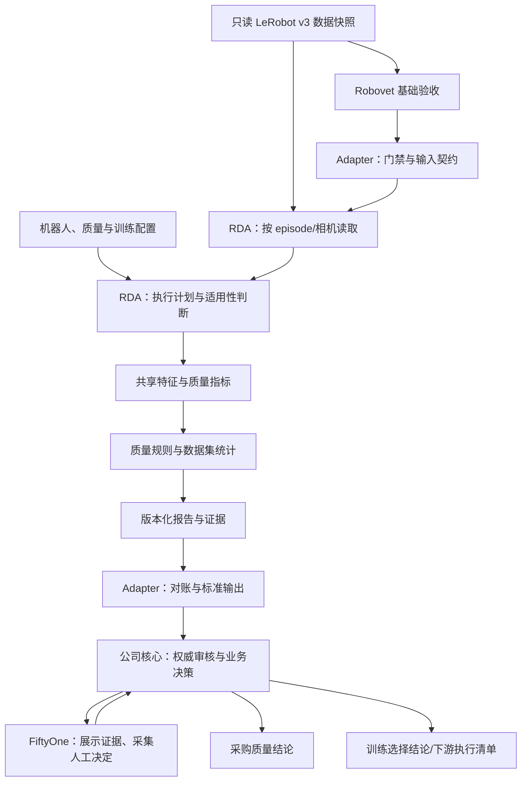

# RDA 训练质量组件补齐设计

日期：2026-09-10

状态：待评审设计稿；本次只形成设计，不代表下述能力已经实现。

适用范围：公司内部采购数据进入训练前的质量分析；首期 LeRobot v3.0、一种机器人、H.264/MP4。

源码基线：RDA `e998aedd5b12529ba975c091efe8e478b888c766`；Robovet/Adapter `1bec23b35ab0546c95ff4bec98653920016c85cf`。

## 1. 设计结论

建议复用 RDA 的指标、LeRobot 读取、参考分布和 JSON 报告基础，在内部使用路径增加明确的“训练质量模式”。先补结果可信性，再完善质量分析，最后做容量与真实数据校准。

RDA 要回答的是：**这批通过基础验收的数据，哪些地方可能影响目标训练，证据在哪里，哪些部分尚不能判断？**

RDA 不重新签发采购验收结论，也不生成修复后的 LeRobot 数据集。其 `PASS / REVIEW / EXCLUDE` 是配置范围内的训练质量建议，不是公司最终结论。FiftyOne 只展示证据并采集人工决定；公司核心保存权威审核记录，并分别生成采购质量结论和训练选择结论。两种结论必须允许不同：同一条轨迹可以采购质量合格，但因本次策略的任务、窗口或分布要求而不进入训练。

“基础验收通过”不代表训练价值足够；“统计异常”也不必然代表坏数据。正常等待、接触、夹持、人工接管、失败恢复和罕见任务都可能产生异常信号，不能按一个总分直接删除。

## 2. 已确认约束与本稿采用的原则

沿用此前决定：内部自用、原始数据只读、默认离线、通用核心加机器人配置、首期只验证一种机器人；暂无真实供应商样本与真实机器人配置，可以用占位配置开发。Robovet 的快速预检与正式全量视频解码两种模式继续保留。

本稿补充以下必要原则：

1. **每项业务判断只有一个责任组件。** RDA 读取字段、检查自己能否计算是必要的输入保护，不算重新做一套采购验收；遇到输入矛盾应报读取错误或前提失效，不替 Robovet 改判。
2. **先计算事实，再应用规则。** 原始测量、规则建议、人工决定分开存储。阈值、动作含义、相机配置或参考集未知时明确记录，不能用默认常数冒充已校准规则。
3. **没有检查到不等于通过。** 每个计划 episode、指标、相机都要有结果或未执行原因；无法读取的数据不能从统计分母里消失。
4. **定位必须可回放。** 所有局部风险应带 episode、相机/动作维度、帧段和时间段，不能只有“这个 episode 不好”。
5. **比较必须限定上下文。** 不混合不同机器人、动作表示、单位、任务和相机条件排名；没有参考分布或覆盖目标时只描述观测范围。
6. **启发式先用于复核。** 首期默认不开自动排除规则。以后 `EXCLUDE` 必须引用显式启用、适用范围明确、经过校准的规则，仍然只是训练建议。
7. **接口保持单一事实来源。** RDA 负责质量测量和质量规则计算；Adapter 负责前置门禁、契约转换与输出，不再长期维护第二套质量评分。
8. **覆盖与成本一起报告。** Robovet 解码通过不能代替 RDA 的像素质量分析；RDA 抽样分析也不能宣称逐帧检查了全部画面质量。

当前信息足以完成设计，无需再次索要尚不存在的数据。真实动作含义、阈值、目标训练窗口和容量目标作为后续启用条件保留，见第 15 节。

## 3. 当前能力及缺口：以实现为准

本节来自当前源码、现有测试和历史源码审计的交叉核对。未在本轮重跑两仓库全套测试，未验证真实供应商数据性能；旧测试数量不能用作本设计的验收结果。

| 领域 | 已有实现 | 必须补齐的差距 |
|---|---|---|
| 指标执行入口 | `audit --metrics`、`--offline`；指标注册与 `MetricBase.compute` | 当前按名称实例化默认参数；无贯通 Adapter 的质量配置、机器人语义、目标训练窗口和有效配置回显 |
| LeRobot v3 读取 | 共享 Parquet 按 `episode_index` 筛行；读取视频 from/to 区间及 task 身份 | episode 读取异常仅警告后跳过；容错路径可能掩盖实际读取位置；跨文件 episode 缺少完整读取证明 |
| 动作质量 | idle、MAD 动作跳变、state 差分速度/加速度 | 默认猜主要动作数组、混合维度求范数；位置/速度/增量动作含义不区分；MAD 为零时可能漏掉孤立突变 |
| 时序利用率 | idle 前缀、活动段、5/10/20 帧窗口比例 | 固定窗口未贯通实际 policy 参数；“全活动窗口比例”不能等同训练器可用窗口比例 |
| 分布与覆盖 | action/state 数值摘要、轨迹统计、状态占用网格 | coverage 使用 state 前三维和每 episode 自身范围；不等于任务覆盖、工作空间覆盖，也不能直接跨 episode 比较 |
| 视频冻结 | 灰度帧差、冻结区间、结合 action 活动信号 | 视频/动作主要按长度比例对应；动作含义未知会影响解释；需要真实时间定位、相机级覆盖和证据保留 |
| 视觉质量 | 模糊、曝光、对比度；每 episode 每相机最多 10 帧抽样 | 固定缩放/中心裁剪/阈值；抽样 seek 可返回目标前一帧；未完整报告实际成功样本、部分相机失败与覆盖盲区 |
| 多相机同步 | `video_stream_sync` 检查文件存在及视频 span 时长差 | 并未检查内容事件同步；同长度固定错位可以漏掉；主要与 Robovet 的基础校验重叠 |
| 参考校准 | `ReferenceProfile`、MAD/PCA/分位数评分、数据集 Tukey/IQR 摘要 | CLI audit 未把 reference scorer 接入；分数未完整贯通主 JSON；小样本、零方差和混合任务需要处理 |
| 报告与建议 | metric availability/measurement/assessment/details；episode verdict；两套报告形式 | 总体分类按指标名与 has_finding 决定；轻度视觉 REVIEW 可能被提升为 EXCLUDE；NA/ERROR 被分类器忽略 |
| 大数据执行 | episode 迭代、Parquet 和视频缓存 | 核心串行；元数据、episode 结果和最终 JSON 累积在内存；缓存按条目而非字节；无可靠续跑与阶段提交 |
| UI、导出与推荐 | Streamlit、clean export、recommend 分支 | 与 FiftyOne 重叠；clean export 不满足完整 v3 重建需求；远程 recommend 不纳入内部质量链路 |

额外注意：现有 `score` 是历史兼容字段，可能只是把 pass/review/na 映射到数字；部分报告的 deviation 值混合时长、突变次数等不同量纲。它们均不能直接解释为“坏数据概率”或预计训练收益。

## 4. 三个工具及 Adapter 的职责边界

| 能力 | 主责任方 | RDA 的处理方式 |
|---|---|---|
| 文件交付完整性、schema、dtype/shape、NaN/Inf | Robovet | 消费已验证数据；遇异常记录前提失效，不重复出验收结论 |
| episode/task/index、metadata 与数据引用 | Robovet | 按给定身份读取；核对自己是否完成读取和计算 |
| 视频能否解码、帧数、timestamp/PTS 基础映射 | Robovet | 引用证据；读取像素以计算冻结和视觉质量 |
| 声明单位/坐标系/字段语义、配置的硬范围与关节限位 | Robovet | 复用同一机器人配置，解释统计指标，不重做 joint_limit |
| 输入快照绑定、Robovet 门禁、跨组件版本适配 | Adapter/公共契约 | RDA 只校验收到的契约和实际读取是否匹配 |
| 动作突变、静止结构、速度/加速度统计风险 | RDA | 计算测量与训练复核建议 |
| 目标训练窗口、任务分布、观测状态覆盖 | RDA | 输出诊断和缺口，保留依据与适用范围 |
| 模糊/曝光/冻结等像素质量 | RDA | 按明确采样计划分析并提供异常片段 |
| 内容事件错位、视觉与动作延迟 | RDA 后续条件能力 | 需相机/事件依据与实测；首期不声称已覆盖 |
| 人工浏览与决定采集 | FiftyOne | 展示 RDA/Robovet 证据、定位片段、记录人工意见；不保存公司的唯一权威决定 |
| 权威审核记录、采购质量结论 | 公司核心 | 依据 Robovet 验收证据、RDA 质量建议和业务规则分别形成并审计留痕 |
| 训练选择结论 | 公司核心 | 依据本次策略、任务和人工决定生成；与采购质量结论独立，可选择不训练合格轨迹 |
| 重采样、删除帧、重编码、v3 索引重建、训练执行 | 独立下游流程 | 本组件不实现 |

对旧适配设计作两处明确收敛：`joint_limit` 交由 Robovet；`video_stream_sync` 的旧“存在性和时长差”实现不再作为内部训练质量判断。旧名称保留兼容说明，不能悄悄换成内容同步算法。

采购方可引用 RDA 报告辅助讨论数据质量，但合同门槛及是否接收该批交付属于验收流程，不能由 RDA 的统计排名自动决定。

## 5. 实现方案比较与总体结构

| 方案 | 优点 | 代价/问题 | 结论 |
|---|---|---|---|
| 在 RDA 增加明确的质量模式，复用原核心 | 指标、读取、报告基础可复用；核心能力归属清楚 | 要修正分类和结果契约，配套升级 Adapter | 推荐 |
| 在 Adapter 里补所有算法和规则 | 初期少改 RDA | Adapter 变成第二个 RDA，配置、证据和性能逻辑两处维护 | 不采用 |
| 另写完整质量引擎 | 可重新设计全部接口 | 丢失已有代码价值，开发与验证范围过大 | 暂不采用 |



RDA 内部分为六个可独立测试的单元：配置与指标计划、episode/媒体读取、共享特征计算、质量指标、参考分布与规则、执行和报告。优先沿用 `io/`、`metrics/`、`calibration/`、`audit/`、`report/` 的现有边界，避免为本次工作重构无关 UI 或推荐服务。

## 6. A0：先补齐真实接口闭环，责任仍在 Adapter

适配层已有 CLI 调用、超时、报告文件校验、指标选择和标准产物输出基础，但当前代码并未满足旧设计文档中的全部保证。以下是 RDA 新模式可靠接入的前置工作，不算已经完成，也不转移到 RDA 指标层。

| 实际差距 | 必要补齐 |
|---|---|
| Runner 只传 metrics/offline/output，profile 多数参数未参与计算 | 规范化配置后传入 RDA；核验 RDA 回显的实际生效参数和 hash，未知字段必须报错 |
| Normalizer 不验证报告 schema；任务读取未覆盖 `task_description`，版本读取未覆盖 `tool_version` | 为旧 RDA schema 1.0 建立显式映射；新 schema 独立分支，拒绝未知主版本 |
| 只遍历 RDA 返回 episode；空/缺失列表可能归为 PASS | 建立预期 episode 集；按 ID 集合对账；缺项补出错误/未完成记录，重复/额外 ID 拒绝正常发布 |
| 单项 `assessment.status`、`availability`、details 未完整进入标准产物 | 保留每项状态、测量与片段证据；未执行清单细化到 episode/metric/camera |
| 前置读取未强制正式 full 模式，部分身份来自 RDA 自报；输出路径尚可能与 Robovet 报告目录重合 | 复用已有 verified reader 并强制正式验收及必需项覆盖；可信身份只能来自核验后的输入，冲突拒绝；输出及缓存必须与数据、Robovet 证据目录隔离 |
| RDA 遇 EXCLUDE 可退出 2，Runner 将所有非零均视为运行 ERROR | 按已协商的协议版本解析退出码；旧版合法报告的 2 是质量发现，新版以结构化运行状态为准 |
| 真实 Robovet run 未提供 Adapter 期待的数据内容指纹；episode inventory 用 `raw_id` 等字段 | 对齐真实 producer 字段；形成绑定验收运行的快照身份与 episode 读取清单，不能仅依赖模拟报告 |
| 当前重算数据 hash 不等于证明旧验收针对同一字节；无运行后变化检查 | 先建立与验收同时绑定的快照/内容清单；审计期间使用不可变快照，或进行前后变化检测并声明保证级别 |
| 现有输出 `filepath` 可能是 Parquet；标注字段尚无完整视频区间契约 | 增加多相机媒体引用、from/to、帧与时间定位；在 FiftyOne 接口中明确导入方式，不能直接当可播放媒体路径 |

快照契约由公共接口定义，Adapter 负责转换并核验来源；如需要 Robovet 增加快照标识/内容摘要字段，只做最小证据扩展。不能在事后给旧验收报告附上当前数据 hash 就宣称完成历史绑定；必要时在已固定的快照上重新运行验收。

A0 的完成条件是：**真实 Robovet producer → 实际 RDA CLI → Adapter 标准输出**在合成 v3 数据上运行，正常与故障分支均有覆盖。使用手写 JSON 或模拟 RDA 的测试继续保留，但不能单独满足这一条件。

完成 RDA 组件集成时，还需实际导入 FiftyOne 验证 episode/相机/时间定位及人工字段保留；这一消费侧测试属于适配验证，不要求 RDA 开发 UI。RDA quick 仅表示质量采样计划，内部正式链路的前置仍为 Robovet full；不能用 quick 名称绕开基础验收。

## 7. 输入、配置和 CLI 契约

### 7.1 输入清单

内部质量模式接受：只读数据快照、Adapter 提供的输入清单、质量配置、可选真实机器人/训练目标/参考集配置、数据目录外的运行目录。

输入清单至少包括：

- `contract_version`、数据集身份、快照内容摘要及保证方式、Robovet 运行/证据摘要；
- 本次 scope 与完整预期 episode ID 集，包括显式限定子集时的 scope 摘要；
- episode 的 `task_index`、采购标准 `task` 文本、行数、数据文件与行段；
- 每个相机的 feature key、相对媒体路径、episode 对应的 from/to 时间段及时间映射引用；
- 可用于分层的 supplier/task/scene/operator/session 等来源字段；缺失就记 unknown，不虚构标签。

清单可以拆成索引与 JSONL，避免整体载入内存。RDA 不导入 Robovet 的内部 Python 类型，也不反向修改其报告。

### 7.2 三类配置，职责不混用

| 配置 | 内容 | 缺失时的行为 |
|---|---|---|
| robot profile | action/state 字段、每组维度的物理量与单位、动作表示、坐标系、周期角、夹爪/离散量、相机标识 | 保留原始维度统计；需要语义的指标不评判物理意义 |
| quality profile | 指标及 required_for_advice/informational 角色、算法参数、规则阈值、校准状态、适用任务/相机、采样与资源预算、参考集身份 | 未配置规则不产生正式 PASS/EXCLUDE；可生成标注为 provisional 的 REVIEW 线索 |
| training profile | policy 类型、观测历史长度、动作预测跨度、采样步长、padding/边界处理、必需模态 | 计算通用时长/活动结构；目标窗口适用性记未评估 |

机器人基础语义复用同一份配置及摘要；RDA 只增加质量分析需要的维度分组和统计参数，不另维护一份相互矛盾的机器人事实表。

必须输出 `effective_config`：最终启用指标、实际参数、参考集、采样计划、配置/规则/算法版本与 hash。配置中出现不支持的字段、互相矛盾的参数、未声明的 metric，预检失败；不能只把 `threshold_version` 写进报告而仍用代码常数。

requested 与 effective 配置分别保存，引用的配置文件按内容摘要绑定。hash 使用规范化 JSON 和明确算法版本；字典键顺序变化不能改变语义 hash，不允许用 Python 对象字符串表示代替规范化。数据身份、task、Robovet 状态与路径以已核验输入清单为准，RDA 返回值只能一致回显，不能覆盖它们。

### 7.3 版本化 CLI 扩展

保留现有 `rda audit --format json --metrics ... --offline --output ...`。以下仅为待实现的接口设计，当前不能直接使用：

```text
rda audit DATASET --mode quality --config CONFIG
  --input-manifest MANIFEST --output REPORT --offline
  [--run-dir RUN_DIR] [--resume]
rda capabilities --format json
```

`capabilities` 声明支持的模式、报告主版本、指标算法版本、配置字段、依赖及输出方式。指定 config 与 metrics 时必须一致，否则报错；无质量配置的 legacy audit 保持兼容，但不能由 Adapter 自动当作内部正式质量模式使用。

内部路径始终离线，不调用 recommend 服务或隐式模型下载。环境变量只是配合措施，需用禁网测试证明实际调用链没有请求网络。

生产执行将源数据和 Robovet 证据以只读方式提供给子进程；同时规范化路径、解析符号链接，拒绝输出/缓存与受保护目录重合或存在会覆盖输入的嵌套关系。只读承诺不能仅建立在“当前代码没有主动写源文件”上。

安装交付需提供最小质量分析依赖组及锁定文件，显式包含本地 Parquet 读取需要的 pandas/pyarrow、视觉需要的 PyAV，并验证其系统解码库。使用干净环境安装测试；不为运行质量分析强制安装完整训练栈、Streamlit 或模型权重。缺可选依赖在 capabilities 和对应指标结果中说明，不能等运行一半才从报告中消失。

## 8. RDA 必要能力补齐

### R1. 准确读取与覆盖台账

消费输入清单，按 episode 实际所属的全部数据行段读取；若目标 v3 交付契约不支持某布局，明确返回 unsupported_layout，不能只读第一份文件。保留原始 timestamp，不合成时间轴掩盖缺失。

所有计划项必须最终落在四层状态定义的终态组合之一，并带 reason_code。一个 episode 读取失败可以让其他 episode 继续产出诊断，但整次运行标记 PARTIAL 或 ERROR，不能发布“完整通过”。

视频按半开区间 `[from_timestamp, to_timestamp)` 取帧。关键帧 seek 只决定解码起点；真正样本必须按 PTS 再筛选，返回实际 PTS，并验证属于当前 episode。记录目标时间与实际时间误差，不能把上一段视频边界帧算进当前段。

### R2. 共享语义特征与运动质量

idle、temporal、freeze 共用一次计算的活动信号，避免三处定义“移动”不一致。明确区分动作命令变化、state 的实际变化和图像变化。

- 绝对位置命令、增量位置命令、速度命令、力矩与夹爪开合使用不同解释；恒定非零速度命令不能因为命令不变就判静止。
- 每个物理维度组先独立计算；只在明确声明归一化方法后合并，不把米、弧度、布尔量直接求一个范数。
- 周期角、姿态表示、夹爪离散跃迁分别处理；不支持的表示明确未评估，首期不假装完成所有机器人类型。
- 突变输出受影响维度、相邻帧、持续时间、幅值与阈值；MAD 为零、近零或样本太少时，采用显式数值退化规则或只报告测量，不能将所有突变分数清零。
- 速度/加速度优先由具有物理含义的 state 和真实时间差推导；导数定义、单位、差分/平滑方法均版本化。时间前提失效返回错误，不用极小 dt 替代后继续下结论。
- 单纯 idle 高、加速度大只给复核线索；接触、保持和恢复动作可通过任务配置/已有标签解释，但标签未知不能臆测任务成功或失败。

首期没有真实机器人 profile 时，允许计算逐维数值变化和通用时长，物理速度、实际静止和物理覆盖的判定保持未评估。

### R3. 面向目标训练的时序诊断

将现有 idle 结构、活动段和滑动窗口计算复用为本地能力，接入实际 training profile。分别报告：

1. `structurally_available_windows`：优先消费固定版本真实训练 loader 生成的候选窗口索引；只有在没有 loader 时才运行等价参考实现，并标为未对齐。这是消费侧可用性计算，不重做源数据完整性验收。
2. `active_window_ratio`：满足指定活动条件的窗口占比；它是内容测量，不能叫“有效训练数据比例”。
3. `no_detected_risk_window_ratio`：在已完成的质量检查范围内，不与已配置风险片段相交的窗口占比；“没有检测到风险”不代表不存在其他风险，同时披露未检查窗口。

窗口索引契约必须包含 delta timestamp、episode 边界、padding mask、action horizon、动作/观测对齐规则和多相机时间容差。RDA 与固定版本训练 loader 做候选索引差分测试；采样语义不支持或无法证明一致时输出 `UNASSESSED`，不能自行推断 policy 的取样行为。

窗口不跨 episode 拼接。目标窗口长度、padding 或动作对齐未知时，只计算通用统计，不推断 Cosmos 或任何模型的默认要求。只输出候选风险区间及其对窗口的影响，不裁剪数据，不自动丢弃静止帧。

### R4. 视觉质量与冻结证据

保留 H.264/MP4 首期范围，统一媒体读取与灰度特征复用。每个指标、每个相机记录：计划样本、实际样本、真实 PTS、成功/失败数、采样方式、缩放与 ROI 参数、未覆盖部分。

视觉分析提供两类执行计划：

- `quick`：确定性的分层/均匀抽样，用于发现明显问题；报告只能描述抽到的画面。
- `standard`：每个计划 episode/相机都执行；冻结检测连续读取计划区间，视觉质量按明确的最大采样间隔或逐帧配置执行。是否“逐帧”逐指标记录，不因为所有 episode 跑过就声称覆盖每帧。

视觉质量输出模糊、亮度/高光裁切、低对比度的测量与风险片段。阈值按相机分辨率、预处理、ROI 和任务校准；保留当前灰度算法作为基础，不在首期增加大型视觉模型依赖。

冻结分开报告“画面低变化/重复”和“有可解释运动证据时仍重复”。夹持静止、相机看不到机械臂等情况不会被直接断言为掉帧。没有可用动作/state 语义时可保留图像重复测量，但不能完成冻结成因判定。

短暂局部异常不能被全 episode 中位数掩盖；输出最差片段、持续时间与受影响比例。证据条目有预算时，报告总发现数、保留数和截断标记；不隐瞒省略。

旧 `video_stream_sync` 在质量模式中作为 deprecated/delegated 能力记录，不调用旧算法，也不计入“质量检查成功数”。未来内容同步另建独立 metric ID 和版本，需事件锚点、相机重叠/可观察性说明和固定延迟缺陷注入测试后再启用。

### R5. 数据集分布、任务与覆盖诊断

先完成无需模型的统计：按机器人/动作表示/任务/相机/来源分组，统计 episode 数、总时长、活动时长、质量状态、动作范围及参考偏离。

保留 task_index 与 task 文本原值。跨数据集任务合并使用显式映射表，不用文本相似度暗中合并；映射和数据版本进入报告。

覆盖分析要求选择有意义的维度和固定坐标/网格边界：可用机器人指定空间、已固定参考集范围或业务目标。沿用每 episode 自身 min/max 的算法时，只能命名为局部状态占用测量，不能用于跨 episode 排序或表示机器人真实工作空间。

目标任务清单未知时，展示“已观测任务分布”；不能推断没有定义过的任务是否缺失。目标任务已给定后，输出缺失任务和样本不足组。对于 reference 中没有的任务，标为分布外/无可比参考，而非坏数据。

完全重复/近重复视频、语义聚类、跨训练验证集泄漏分析放到后续 FiftyOne/数据管理能力设计；RDA 首期输出分组身份和统计，不再建设第二套 embedding 与人工去重工作流。

### R6. 校准、规则与可解释建议

复用现有 reference/calibration 的统计工具，但新质量模式必须改成 `measurement record → metric-local rule evaluation → 公司核心业务决策`。CLI 将本次运行已经生成的 measurement records（含 algorithm_version、effective_config 摘要和 applicability）交给 scorer；scorer 只能消费这些记录，不得重新从 EpisodeData 按默认参数计算，也不得把缺失值填成 0。参考集明确记录样本来源版本、适用任务/机器人/相机、计算方法、维度、样本数和 hash。

质量模式禁止沿用旧 `MetricResult.make_pass` 把“已计算但没有判断规则”构造成 PASS。测量成功只产生 `COMPUTED + UNASSESSED`；规则评估必须引用实际生效的 metric-local rule、版本和阈值。公司核心再结合采购制度、训练策略和人工决定形成权威业务结论，RDA 不写入该结论。

分开三类依据：

- 本批次相对统计：仅用于本批异常排序；全批质量都差时仍可能看起来“正常”。
- 已人工复核的参考集：适用于相同条件下的偏离分析。
- 业务启用的质量规则：有阈值、持续时间、适用范围与校准记录，才能驱动正式质量建议。

小样本、MAD/IQR 为零或参考维度不匹配必须有明确退化状态；不能把缺失测量填零并参与总分。不同组、不同分数版本不能直接排序。

首期默认 `risk_score: null`，以规则原因和原始测量复核。需要排序时先使用有定义的单项指标或同参考组 percentile；只有明确定义聚合算法、分值方向、缺项处理和校准范围后才提供总风险分，且不能解释为概率。

修正按“指标名字在 critical 列表”就升级 EXCLUDE 的旧分类路径。质量模式只读取实际 assessment 和显式规则；`video_freeze` 的轻度 REVIEW 不会被自动升级。Adapter 现有 `exclude_on/exclude_reasons` 在迁移期转成同一规则配置供 RDA 执行，新模式不得在 Adapter 再次独立评分。

旧产品报告中的 DHI/Ready 默认补分与训练就绪结论不进入质量模式；只保留已定义的测量、覆盖和规则建议，避免缺项时仍生成看似健康的分数。

### R7. 本地批量、资源限制与恢复

这一阶段负责 RDA 自身的计算调度，不复用或重复实现 Robovet 验收流程。Adapter 仅管理整个子进程生命周期与协议。

- Parquet 分批读取、按所需列投影；结果与证据流式写入。数据集统计采用可合并摘要，精确/近似分位数必须记录算法和误差方式。
- 相同物理视频尽量顺序解码，向各 episode/metric 分发对应区间；冻结与视觉质量共用帧特征，避免每个指标反复打开同一媒体文件。
- 并发以 episode 计算与媒体读取资源为单位，显式控制 worker、内存/缓存字节、文件句柄、解码并发、运行时间、输出磁盘和证据数量；避免任务与解码库各自无限开线程。
- 特别长的 episode 使用分段计算与必要的边界重叠；不能让“最多并发几个 episode”冒充内存上限。暂不支持分段的指标应报预算不足，不能静默抽掉尾部。
- 以快照、输入范围、配置、算法/依赖版本、采样计划和随机种子构成恢复键。相同运行目录中只复用已完成且校验和有效的计算单元。
- 元数据定位、特征提取、指标测量、参考集评估和发布分别记录阶段状态。聚合阶段重新从已确认结果构建，不累计重复 episode。
- 中断后保留已完成成果，重启从未完成阶段继续；输入或配置变化时不混用旧缓存，而是开启新运行或明确失配。
- 先写 staging 和产物 hash，最后写完成标记；单个文件原子写不等于整套报告事务成功。消耗方必须验证完成标记和全部 hash。
- CLI 大报告不再同时输出完整 JSON 到 stdout；日志有上限。Adapter 改用文件/流式结果读取，避免 `capture_output` 和 `json.load` 抵消 RDA 内部优化。

首期实现本地单机可恢复批处理，不增加分布式队列、Kubernetes、多租户平台。并发上限和缓存预算通过机器实测确定，不提前承诺 TB/PB 吞吐。

## 9. 状态与覆盖规则

新报告分开四层状态，避免一个 PASS 同时表示“进程没崩”“检查完成”“适合训练”：

| 层面 | 状态/字段 | 含义 |
|---|---|---|
| 适用性 | `APPLICABLE / NOT_APPLICABLE / UNKNOWN` | 当前指标是否适用于该 episode、相机或维度组；未知不能当作不适用 |
| 执行 | `COMPUTED / SKIPPED / FAILED / CANCELLED` | 该计划单元是否得到测量；失败、跳过和取消必须各有 reason_code |
| 评估 | `UNASSESSED / PASS / REVIEW / EXCLUDE_CANDIDATE` | 是否有实际规则依据及其质量建议；无规则的测量只能是 UNASSESSED |
| 运行 | `COMPLETED / PARTIAL / BLOCKED / ERROR / INTERRUPTED` | 整体计划、前提和发布过程是否完成 |

正式执行计划 `execution_plan` 是报告的一等产物。每个 `episode × metric × camera_or_dimension_group` 生成稳定的 `plan_unit_id`，包含输入引用、算法/配置 hash、预计资源和采样范围；每个单元的 `unit_result` 必须同时写入 `applicability`、`execution_state`、`assessment` 及覆盖摘要，并在终态只出现一次。重试可以产生内部 attempt 记录，但发布结果必须去重并明确最终终态。计划与结果的集合差异、重复 ID 或无终态均阻止完整发布。

`coverage` 分别记录执行计划完成度和原始数据实际采样覆盖，包括 planned/attempted/computed/skipped/failed/cancelled 单元数、适用性分布及采样范围。按计划抽 10 帧且全部成功，可以是计划完成；不能写成该视频帧覆盖 100%。

Adapter 原来的六态只能作为兼容字段，由四层状态派生：运行级优先级固定为 `BLOCKED > ERROR > INTERRUPTED > PARTIAL > COMPLETED`；运行前提失效为 BLOCKED，必需单元 FAILED 为 ERROR，用户中止为 INTERRUPTED，有未终态单元为 PARTIAL，全部计划单元完成才是 COMPLETED。必需单元 SKIPPED/CANCELLED、适用性 UNKNOWN 或评估 UNASSESSED 时，episode 兼容字段为 NOT_AUDITED；其余才按显式规则汇总 REVIEW/EXCLUDE/PASS。兼容字段不能作为新链路唯一判断。

`informational` 指标缺少判断规则不阻止其他已配置指标给建议，但必须显示 UNASSESSED。`required_for_advice` 指标没有语义、阈值或覆盖时不能输出 PASS。临时启发式可以给带 provisional 标签的 REVIEW；没有命中临时阈值，不等于完成校准后的 PASS。

可选指标不适用要有理由；配置为必需的指标不适用不能自动放行。空任务范围不得生成非空交付的 PASS；明确请求空子集时运行可为 COMPLETED，但必须注明 `no_work: true`、计划范围为零且质量建议未评估，不生成候选保留清单。

## 10. 报告与证据契约

质量模式使用独立的质量建议产物；RDA 原始报告与内部恢复文件放在独立子目录，不能让两个组件同时写同一个 `run.json`。旧 Adapter 的 `training_selection_manifest.jsonl` 只作为 deprecated 兼容别名，内容仍是质量建议，绝不能被当作最终训练放行清单。

| 外部产物 | 补齐内容 |
|---|---|
| `run.json` | 运行状态、范围/快照/版本/配置/依赖身份、effective_config 引用、覆盖摘要、产物 hash、完成标记 |
| `quality_report.json` | 分组统计、计划与实际覆盖、规则来源、未评估项、参考范围、诊断限制 |
| `episode_quality.jsonl` | episode 原始身份、task_index/task、逐指标测量/评估、质量建议、媒体引用和 provenance |
| `findings.jsonl` | 稳定 finding ID、规则 ID/版本、实际测量、阈值、维度/相机、frame/time 区间和证据引用 |
| `not_audited.jsonl` | episode/metric/camera/区间、缺语义/配置/依赖/预算/执行失败等 reason_code；错误与不适用分开 |
| `quality_advice.jsonl` | RDA 的候选质量建议及来源；保留 human_decision 空值，明确不是最终训练放行清单 |

身份至少由数据集快照和 episode ID 共同构成，不能只使用供应商可能重复的 revision 文本。相对数据路径从输入快照根解析；多相机媒体用列表表达，Parquet 路径与媒体路径分别命名。

公司核心保存 append-only 的审核事件（决定人/系统、时间、依据版本、理由、数据身份和变更关系），并从这些事件分别生成 `procurement_quality_decision` 与 `training_selection_decision`。FiftyOne 的人工字段是采集入口和可回放副本；重复导入、重新审计或重新生成质量建议不得清空既有事件。公司核心生成的正式训练清单使用独立名称和版本，RDA 不产生该文件。

episode 记录只保留 `rda_assessment` 及其证据；公司核心记录至少包含：

```json
{
  "rda_assessment": "REVIEW",
  "procurement_decision": {"value": "ACCEPT", "reviewer": "user-17", "run_id": "accept-2026-09-10-01", "reason": "..."},
  "training_decision": {"value": "EXCLUDE", "reviewer": "user-17", "policy_version": "policy-pick-v2", "run_id": "train-2026-09-10-03", "reason": "window coverage below target"}
}
```

两个决定都必须引用数据快照、Robovet 运行 ID、RDA 运行 ID 和相应证据版本；示例中的值仅说明字段关系，不是默认决定。

片段定位统一使用：episode 内零基帧半开区间 `[start, end)`、episode timestamp 秒、媒体原始 PTS 及 time_base、相机 feature key。实际帧映射不足时记录定位误差或未定位原因，不能伪造精确 frame_index。

所有结果携带 metric_version、rule_version 和 evidence_level。证据分为测量、启发式、参考偏离、业务规则，不把启发式描述为任务语义证明。人工意见存为独立事件/字段，不覆盖 RDA 原始报告；重复运行也不能清空既有复核记录。

新 RDA 质量报告使用新的主版本，与旧 `report_schema_version: 1.0` 分支显式区分。主版本升级由 RDA 和 Adapter 契约测试共同放行；旧格式不会因为多了几个同名字段就被猜测成新协议。

## 11. 兼容与迁移顺序

1. 锁定两仓库当前基线，保留现有指标选择和离线测试；增加真实 producer/consumer 对接样例。
2. A0 先补旧报告的明确映射与覆盖保护，不能让空报告、缺版本或未知 episode 静默通过。
3. 定义并实现 quality config、capabilities、新报告 schema；新接口上线前 Adapter 不使用尚不存在的参数。
4. 通过能力协商选择旧/新分支；旧分支保留诊断兼容限制，新模式输出实际生效配置和严格状态。
5. 新模式下禁用完整性指标与旧同步/关节限位重复项；用户请求委托项时给出明确委托说明，不悄悄运行。
6. 使用统一的 RDA 质量规则替代 Adapter 二次提升规则，保留迁移映射和回归样例。
7. 流式 bundle 与续跑协议在 R7 联动升级，两端一起验证，不能只优化 RDA 内存而保留 Adapter 的全量捕获。

保持 legacy 模式回归不意味着要把上游所有模块改成内部用途。内部入口必须显式选择 quality 模式；原 UI、clean export、remote recommend 不接入此流水线。

## 12. 逐阶段交付与完成标准

| 阶段 | 主交付 | 完成标准 |
|---|---|---|
| A0 接口闭环 | 真报告映射、快照/episode 绑定、旧退出码处理、逐项证据保留 | 真实 Robovet → 真实 RDA → Adapter 合成数据链路成功；缺项/错版本/坏报告明确失败 |
| R1 可信输入与结果 | 输入清单、配置、状态/覆盖、准确 v3 读取、新 schema | 计划范围与所有终态记录对账一致；共享文件边界测试不串段；未评估不冒充 PASS |
| R2 动作与 R3 时序 | 语义分组、统一活动特征、突变/导数、可配置窗口 | 零 MAD 尖峰、恒速命令、周期角/离散量和窗口边界等有明确预期；缺语义路径可运行且不误判 |
| R4 视觉 | 共享解码、可配置采样、相机级覆盖、定位和局部风险 | 实际 PTS 属于正确 episode；冻结/模糊/曝光及静止对照样例可解释；部分失败不隐藏 |
| R5 分布与 R6 规则 | 分层分布、固定边界覆盖、校准贯通、单一规则引擎 | 不混排不同机器人/任务；参考失配与小样本不误放行；总分/规则来源完整 |
| R7 容量与恢复 | 流式结果、字节预算、受控并发、同目录续跑 | 受控资源下中断续跑与不中断输出一致；损坏缓存拒用；跨组件无全量 stdout 内存回退 |
| R8 真实数据校准 | 首个真实 robot/task/camera profile、人工复核参考集、容量报告 | 明确误报/漏报、人工复核一致性、资源测量及适用范围；业务决定是否启用排除规则 |

阶段名称表示实施顺序和复核边界，不表示当前完成度。R1—R7 可在现有条件下用合成数据开发；R8 需要真实数据与业务输入。RDA 的最终训练收益仍需下游固定训练预算的对照实验，不能由指标测试代替。

## 13. 验证设计

### 必需功能与缺陷注入

- 契约：真实工具产物、旧/新 schema、未知版本、缺任务映射、重复/额外/缺失 episode、零结果报告、配置不生效、退出 2、损坏 JSON。
- 读取：多 episode 共享 Parquet/MP4、非零视频起点、关键帧落在前一段、跨文件边界、单相机读取失败、尾部解码异常。
- 动作：恒定位置、恒定非零速度命令、正常慢速移动、单点尖峰且 MAD 为零、周期角跨界、夹爪开合、混合单位、短序列。
- 时序：相同轨迹不同采样率、真实时间差、不同 horizon/stride/padding、窗口接近 episode 结尾；正常等待/保持作为负对照。
- 视觉：冻结但 state 在动、真实静止、模糊/曝光短片段、中心外关注区域、抽样未命中、缺 PyAV、同长度固定偏移只被标为内容同步未评估。
- 校准：少样本、全常量参考、全批次质量下降、未见任务、参考 schema/维度不匹配；不得把自基线异常少解释成绝对质量好。
- 输出与消费：每条 finding 可定位；未检查项与分母一致；原数据和 Robovet 报告运行前后内容不变；FiftyOne 导入及人工决定回写公司核心后保留审核事件；采购质量结论与训练选择结论可以不同；下游导入后保留原 task/episode/相机身份。

### 容量与恢复

规模覆盖 episode 数量增长、单 episode 超长、共享文件数量增长和多相机增长，分别测峰值 RSS、读取字节、解码次数、输出大小和耗时。达到配置预算时要么有界完成，要么结构化停止，不能静默减少覆盖。

中断点包括写结果前后、写 evidence 中途、聚合中途、完成标记之前。验证 worker 数变化和续跑不会导致漏项/重复项；浮点容差和确定性排序规则必须明确，运行时间等运维字段不参与业务结果一致性比较。

### 真实数据与训练验证

人工复核必须同时抽取报警集合与未报警集合，并按任务、相机、供应商分层；不能只看命中的异常估算效果。正常等待、困难成功、失败恢复等必须进入对照集。

在数据与模型目标具备后，由下游比较相同训练预算、固定独立评测集下的结果。未做该实验前只声称“能生成可复核的训练质量风险”，不声称提高策略成功率或世界模型预测精度。

## 14. 首期明确不建设的能力

不新增采购合同规则、完整性检查、物理仿真、任务成功自动裁判、语义标签自动纠错；不重建 Streamlit 人工审核平台；不提供自动修复、视频重编码、完整 LeRobot 清洗导出、训练启动、多机平台或外部推荐服务。

内容同步、近重复检索、训练泄漏检测、世界模型特定训练样本构造作为后续独立设计，先定义消费者和依据，再决定归属。避免把“未来可能有用”全部纳入首版。

## 15. 后续需要业务补充的资料与当前行为

| 待提供资料 | 暂无时如何继续 | 何时必须提供 |
|---|---|---|
| 真实机器人型号、维度含义、单位、动作表示 | 占位 profile、原始逐维测量；语义相关判断未评估 | 正式运动质量规则校准前 |
| 相机分辨率/标定与任务关注区域 | 运行可解释的通用图像测量，记录预处理；无内容同步证明 | 相机质量阈值或内容同步能力启用前 |
| 目标训练器窗口与采样配置 | 通用时序描述，目标窗口未评估 | 声称适配某个 policy/Cosmos 训练配置前 |
| 任务覆盖目标、来源/任务映射表 | 展示已观测分布和未知组 | 声称任务覆盖不足或满足目标前 |
| 有人工结论的真实样本 | 合成缺陷/正常对照验证计算与接口 | 启用正式阈值、参考排序与 EXCLUDE 规则前 |
| 机器资源、实际批量与耗时目标 | 先开发预算控制，输出基准测量 | 承诺生产吞吐和并发配置前 |

以上缺口不阻止当前设计和通用框架实现；不得通过填写臆测值消除未评估状态。

## 16. 关键源码依据

以下路径均以本地固定基线为准；行号用于复核本设计，不代表已提交修复。

| 证据 | 源码位置 |
|---|---|
| metric 选择按默认构造器初始化；audit 不接质量 profile | RDA `rda/audit/episode_audit.py:40`；`rda/cli/main.py:110`、`:234` |
| v3 读取与错误跳过；缓存与整表加载 | RDA `rda/io/lerobot_loader.py:260`、`:354`、`:385`、`:426`、`:932` |
| 默认主要动作、零 MAD、混合范数 | RDA `rda/metrics/motion.py:21`、`:219`、`:284`、`:458`、`:575` |
| 固定窗口及当前 coverage 含义 | RDA `rda/metrics/temporal.py:362`；`rda/metrics/distribution.py` 的 `CoverageMetric.compute` |
| 视觉固定预算、目标附近取帧 | RDA `rda/metrics/visual_quality.py:40`、`:155`、`:295` |
| 冻结与旧多相机时长判断 | RDA `rda/metrics/visual_integrity.py:245`、`:278`、`:510` |
| critical 名单与 NA/ERROR 忽略 | RDA `rda/audit/rules.py:45`、`:72` |
| 参考分数与报告输出链不一致 | RDA `rda/audit/episode_audit.py:171`；`rda/report/json_report.py:37`、`:307`、`:351` |
| 数据集结果全量保存 | RDA `rda/audit/dataset_audit.py:72` |
| Adapter 参数传递、非零退出码、全量捕获 | Robovet `src/robovet/rda_adapter/rda_runner.py:62` |
| Adapter episode 解析与标准记录 | Robovet `src/robovet/rda_adapter/report_normalizer.py:46`、`:76`；`contracts.py:110` |
| Adapter 前置身份/episode 读取 | Robovet `src/robovet/rda_adapter/robovet_input.py:102`、`:145`、`:200` |
| Robovet 真 producer 的身份与 inventory 格式 | Robovet `src/robovet/validation/discovery.py:147`；`validation/metadata.py:224`；`validation/evidence.py:202` |
| 既有机器人语义/硬范围检查 | Robovet `src/robovet/validation/semantic_rules.py:92` |
| Adapter 当前规则与输出能力 | Robovet `src/robovet/rda_adapter/api.py:54`；`outputs.py:65`、`:95`、`:120` |

历史参考文档：工作树 `docs/superpowers/specs/2026-09-09-rda-adapter-design.md`、`docs/rda-adapter/运行手册.md`；工作区 `research/lerobot-v3-toolchain/source-audits/RDA-源码审计.md`。当旧文档能力描述与上述固定源码不一致时，本稿按实装差距列为后续工作，不将设计意图计为已实现能力。
